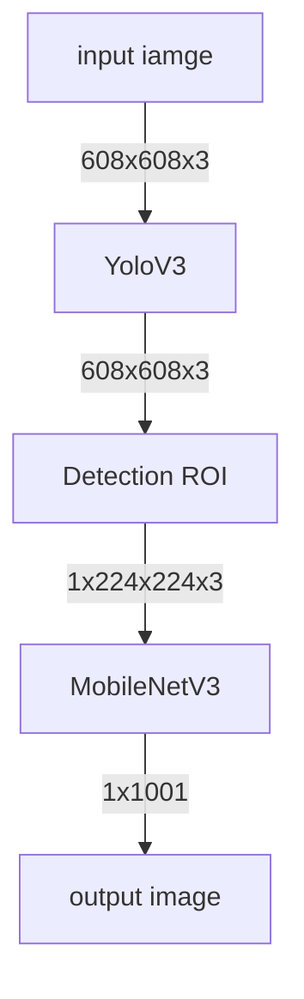

# Mini Project


### 필요 파일
```shell
yolov3 관련 https://pjreddie.com/darknet/yolo/
yolov3.weights
yolov3.cfg

https://github.com/openvinotoolkit/openvino_notebooks/tree/main/notebooks/001-hello-world 주피터 예제 실행 시 다운로드 가능
v3-small_224_1.0_float.xml
v3-small_224_1.0_float.bin
imagenet_2012.txt
coco.names
입력용 강아지 사진
dog.py
```


flow chart:


