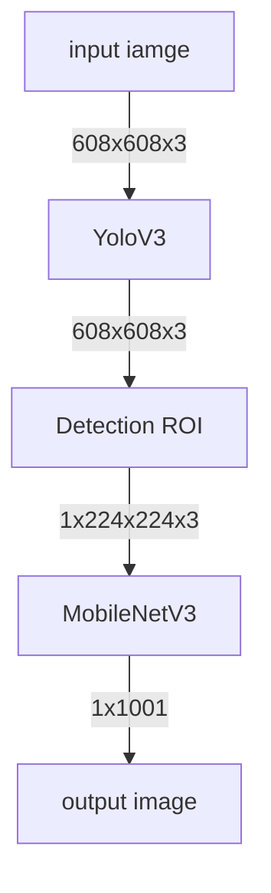

# FINDOG
OpenVino를 활용한 견종 분류 시스템!
## Member introduction
박용근
우창민
이현우
## Purpose
길거리를 지나가던 중 강아지의 견종이 궁금하였다. 
극 I인 나는 견주에게 말을 걸지 못했다…
그래서 만들어봤습니다
강아지를 찍으면 어떤 견종인지 알려주는
FINDOG!

## Diagram
flow chart:


## How to run
```shell
yolov3 관련 https://pjreddie.com/darknet/yolo/
yolov3.weights
yolov3.cfg

https://github.com/openvinotoolkit/openvino_notebooks/tree/main/notebooks/001-hello-world 주피터 예제 실행 시 다운로드 가능
v3-small_224_1.0_float.xml
v3-small_224_1.0_float.bin
imagenet_2012.txt
coco.names
입력용 강아지 사진
dog.py
```
## Result


